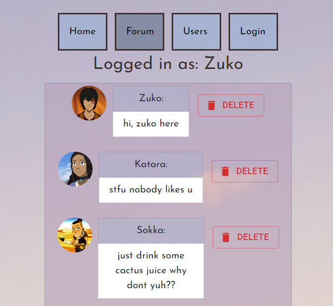

## React Forum Application

For this project, I was assigned to create a single page application from scratch using ReactJS for the front end, and json-server for the backend.

I have decided to create a "Chat" or "Forum" application which allows the user to create a user account along with a personal profile image and make posts and interact within the Chat page.

---------------------

In order to fulfill the project requirements I must:

1) Create a single page application, using only a single index.html file
2) At least 5 React components must be used to keep code organized.
3) At least 3 client-side routes using React Router
4) Use json-server to create a RESTful API
5) Add styling to make the app neat 

---------------------

In total, I have made 8 React components; Home, Chat, Message, MessageList, NavBar, User, Users, Login.

There are 4 different client-side routes: 

/chat  -  chatroom  
/users  -  all users  
/login  -  login page  
/  -  Home page

Data is being fetched from an API I've deployed on Onrender.com (link below) 
GET requests are made in the top level of the app (App.js).
POST requests in Chat and Login components to submit message and new user data. PATCH within Login to update the users profile image.
DELETE is called by an event listener which erases messages from the Chat.

Material UI and Bootstrap was used for styling.

Video: https://youtu.be/GP1t36WpXdU

Backend: https://chat-app-data.onrender.com/

Deployment: https://fusion407-chat-app.netlify.app/